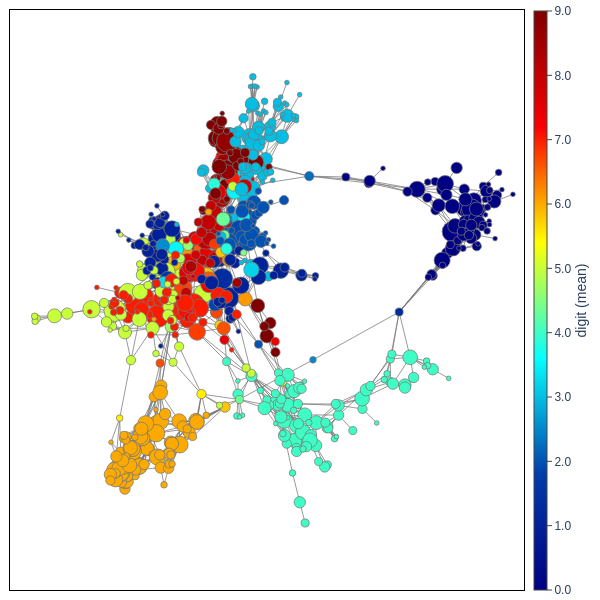

# tda-mapper-python 

 [](https://codecov.io/github/lucasimi/tda-mapper-python)

In recent years, an ever growing interest in **Topological Data Analysis** (TDA) emerged in the field of data science. The core idea of TDA is to gain insights from data by using topological methods that are proved to be reliable with respect to noise, and that behave nicely with respect to dimension. This Python package provides an implementation of the **Mapper Algorithm**, a well-known tool from TDA. 

The Mapper Algorithm takes any dataset $X$ and returns a *shape-summary* in the form a graph $G$, called **Mapper Graph**. It's possible to prove, under reasonable conditions, that $X$ and $G$ share the same number of connected components.

## Basics

Let $f$ be any chosen *lens*, i.e. a continuous map $f \colon X \to Y$, being $Y$ any parameter space (*typically* low dimensional). In order to build the Mapper Graph follow these steps:

1. Build an *open cover* for $f(X)$, i.e. a collection of *open sets* whose union makes the whole image $f(X)$.

2. Run clustering on the preimage of each open set. All these local clusters together make a *refined open cover* for $X$.

3. Build the mapper graph $G$ by taking a node for each local cluster, and by drawing an edge between two nodes whenever their corresponding local clusters intersect.

To get an idea, in the following picture we have $X$ as an X-shaped point cloud in $\mathbb{R}^2$, with $f$ being the *height function*, i.e. the projection on the $y$-axis. In the leftmost part we cover the projection of $X$ with three open sets. Every open set is represented with a different color. Then we take the preimage of these sets, cluster then, and finally build the graph according to intersections.

 

The choice of the lens is the most relevant on the shape of the Mapper Graph. Some common choices are *statistics*, *projections*, *entropy*, *density*, *eccentricity*, and so forth. However, in order to pick a good lens, specific domain knowledge for the data at hand can give a hint. For an in-depth description of Mapper please read [the original paper](https://research.math.osu.edu/tgda/mapperPBG.pdf). 

## Installation

Clone this repo, and install via `pip` from your local directory
```
python -m pip install .
```
Alternatively, you can use `pip` to install directly from GitHub
```
pip install git+https://github.com/lucasimi/tda-mapper-python.git
```
If you want to install the version from a specific branch, for example `develop`, you can run
```
pip install git+https://github.com/lucasimi/tda-mapper-python.git@develop
```

## A worked out example

 you can find a worked out example that shows how to use this package.
We perform some analysis on the the well known dataset of , consisting of less than 2000 8x8 pictures represented as arrays of 64 elements.



It's also possible to obtain a new plot colored according to different values, while keeping the same computed geometry. For example, if we want to visualize how much dispersion we have on each cluster, we could plot colors according to the standard deviation


The mapper graph of the digits dataset shows a few interesting patterns. For example, we can make the following observations:

* Clusters that share the same color are all connected together, and located in the same area of the graph. This behavior is present in those digits which are easy to tell apart from the others, for example digits 0 and 4.

* Some clusters are not well separated and tend to overlap one on the other. This mixed behavior is present in those digits which can be easily confused one with the other, for example digits 5 and 6.

* Clusters located across the "boundary" of two different digits show a transition either due to a change in distribution or due to distorsions in the hand written text, for example digits 8 and 2.


### Development - Supported Features

- [x] Topology
    - [x] custom lenses
    - [x] custom metrics

- [x] Cover algorithms:
    - [x] `CubicalCover`
    - [x] `BallCover`
    - [x] `KnnCover`

- [x] Clustering algoritms
    - [x] `sklearn.cluster`-compatible algorithms
    - [x] `TrivialClustering` to skip clustering
    - [x] `CoverClustering` for clustering induced by cover

- [x] Plot
    - [x] 2d interactive plot
    - [x] 3d interactive plot
    - [ ] HTML embeddable plot
